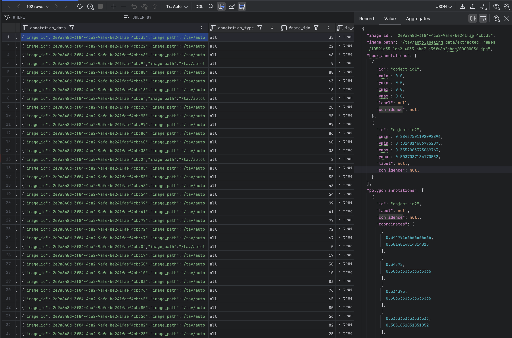
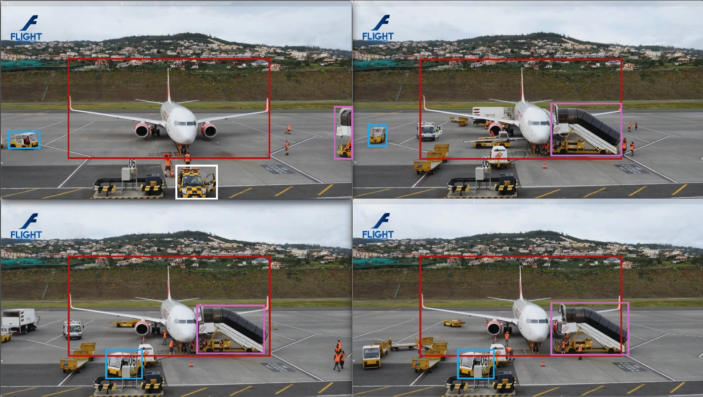
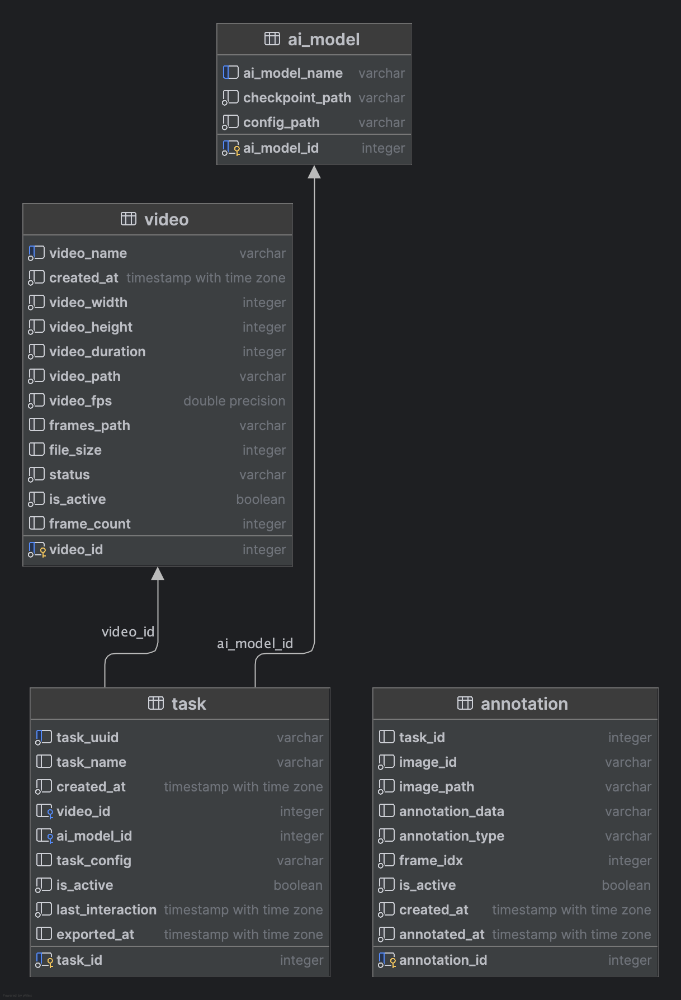

# AUTO LABEL ANYTHING

<p align="center">
  
</p>

**Auto Label Anything** is an open-source labeling tool designed to enhance and extend the capabilities of [Meta's Segment Anything Model 2 (SAM2)](https://github.com/facebookresearch/sam2). Our tool provides an intuitive interface for efficient annotation for videos. As the TAVTechnologies R&D Team, we started this side project to speed up the annotation process for our projects. Now, we want to share it with the community and continue developing it. We are planning to add more features and improve the tool in the future with additional support of opensourcers.

## Features

* 🎥 Automatically segment videos using SAM2 with just a few clicks.
* 👁️ Real-time visualization of segmentation results.
* 📦 Export labeled data in various computer-vision task formats (bbox, polygon, mask).
* 👥 Support for multiple concurrent users.
* 🐳 Fully set up with Docker Compose, including Redis and PostgreSQL.
* ⚙️ Parallel processing for multiple segmentation tasks (workers).

## Table of Contents

- [AUTO LABEL ANYTHING](#auto-label-anything)
  - [Features](#features)
  - [Table of Contents](#table-of-contents)
  - [Usage](#usage)
  - [Requirements](#requirements)
  - [Installation](#installation)
  - [Configuration](#configuration)
  - [Future Development](#future-development)
  - [Additional Information](#additional-information)
  - [Contributing](#contributing)
  - [License](#license)
  - [Contributors](#contributors)
  - [References](#references)

## Usage

**Auto Label Anything** allows you to annotate objects in a video sequence by just clicking several points on these objects. The main goal of the software is pre-annotation.
If you need:
1. Faster pre-annotations on static or large objects
2. Do fast PoC's by quickly annotating several objects in a video
3. Retrieve bbox or polygon annotations for your object detection or segmentation tasks
4. And love building a small project from scratch :)

Then, **Auto Label Anything** is the right tool for you to contribute or directly use in your workflow.


UI is very similar to original Meta's SAM2 UI. However our UI enables more than three object (max size is three for original), video selection, export and model selection between predefined SAM2 models.

To start using it, you need to follow these steps:

1. Be sure to create a new folder to store your videos under the mounted volume in the docker-compose.yaml file. This folder will be used to store your videos and annotations.

```bash
    mkdir -p ./autolabel_data/user_videos
```

2. Import the [`api.json`](./api.json) and [`api.env.json`](./api.env.json) files to [Postman](https://www.postman.com/), [Hoppscotch](https://hoppscotch.com/) or any other API tool to access the API collection.
3. Send a POST request to load videos into the system. Use the following endpoint and payload (path should be accessible from the container):

```bash
    POST http://localhost:8000/api/videos
    Content-Type: application/json

    {
        "video_path": "/path/to/your/video.mp4",
        "video_name": "your_video_name"
    }
```

4. The video status will be `ready` when the initial video processing is complete. You can check it directly from database or send another request. You can now start annotating the video.

To check the video status, you can use the following endpoint:

```bash
    GET http://localhost:8000/api/videos/status/{video_id}
```

5. Access the UI by navigating to `http://localhost:3000` in your web browser. You can start the annotation process by selecting the video you uploaded and using the provided tools to annotate objects in the video.
6. After export, get your annotations from db. (_Note: Visualization and UI enabled editing will be added in the future._)




## Requirements

_This project uses custom Nvidia/CUDA installations and requires a GPU to run. If you prefer, you can host the service submodule on a cloud provider while hosting other systems on your local server or PC._

    Note: CPU and MPS support will be added later.

## Installation

To use **Auto Label Anything**, follow these steps:

1. **Clone the Repository**:

```bash
   # use --recurse-submodules to clone the submodules as well
   git clone --recurse-submodules https://github.com/TAVTechnologies-Research/AutoLabelAnything.git
```

2. **Navigate to the Project Directory**:
   

```bash
   cd AutoLabelAnything
```

  
3. **Run the docker compose project with default settings:**:
    

```bash
    docker compose up --build # -d if you want to run in detached mode
```

## Configuration

 To configure your database and credentials, follow these steps:

1. **Update ./docker-compose.yaml credentials with your preferred credentials.**:

2. **Create .env files for each project and update them with your credentials**:

```bash
   cp ./autolabel-anything-api/.env.example ./autolabel-anything-api/.env
   cp ./autolabel-anything-sam2-services/.env.example ./autolabel-anything-sam2-services/.env
   cp ./autolabel-anything-ui/.env.example ./autolabel-anything-ui/.env
````

## Future Development

* [ ] Video upload support.
* [ ] UI support for bbox prompt.
* [ ] Faster data transfer on UI side using bbox and polygon visualizations.
* [ ] Support for more computer vision tasks.
* [ ] Support for other open-source labeling tools.
* [ ] Support for zero-shot object detection models.

## Additional Information
* Current DB Schema:
  <p align="center">
  
</p>

## Contributing

Contribution is always welcome! The project contribution will be available after release of our code of conduct for our first community project and contribution guidelines. Please stay tuned for updates.

## License

This project is licensed under the Apache 2.0 License. See the [LICENSE](License) file for details.

## Contributors

We would like to thank the following contributors for their efforts (in alphabetical order):

<p>
  <span style="display: inline-flex; align-items: center;">
    
    <a href="https://www.linkedin.com/in/deniz-peker/">Deniz Peker</a>
  </span>
  <br/>
  <span style="display: inline-flex; align-items: center;">
    
    <a href="https://www.linkedin.com/in/gokhankoctr/">Gokhan Koc</a>
  </span>
  <br/>
  <span style="display: inline-flex; align-items: center;">
    
    <a href="https://www.linkedin.com/in/ismailalpaydemir/">Ismail Alp Aydemir</a>
  </span>
  <br/>
  <span style="display: inline-flex; align-items: center;">
    
    <a href="https://www.linkedin.com/in/ozgurkisa/">Ozgur Kisa</a>
  </span>
  <br/>
  <span style="display: inline-flex; align-items: center;">
    
    <a href="https://www.linkedin.com/in/paras80/">Pursenk Aras</a>
  </span>
  <br/>
  <span style="display: inline-flex; align-items: center;">
    
    <a href="https://www.linkedin.com/in/zanasimsek/">Zana Simsek</a>
  </span>
</p>

## References

Below are the references that were instrumental in developing this project:

1. **META Segment Anything 2**  
   - [Official SAM2 Repository]([URL](https://github.com/facebookresearch/sam2))  

2. **PostgreSQL**  
   - [Official Website]([URL](https://www.postgresql.org/))  

3. **Redis**  
   - [Official Website]([URL](https://redis.io/))  

4. **Demo Video**  
   - [Video Used In Demo]([URL](https://www.youtube.com/watch?v=LqoydgYAJZs))  

5. **Helper Websites You Can Use**
   - [Hoppscotch](https://hoppscotch.com/)
   - [Postman](https://www.postman.com/)
   - [Docker](https://www.docker.com/)
   - [Docker Compose](https://docs.docker.com/compose/)
   - [React](https://reactjs.org/)
   - [FastAPI](https://fastapi.tiangolo.com/)
