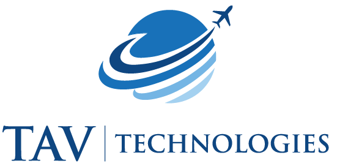

# AUTOLABEL EVERYTHING

<p align="center">
  
</p>

**Auto Label Everything** is an open-source labeling tool designed to enhance and extend the capabilities of [Meta's Segment Anything Model 2 (SAM2)](https://github.com/facebookresearch/sam2). Our tool provides an intuitive interface for efficient annotation for videos. As the TAVTechnologies R&D Team, we started this side project to speed up the annotation process for our projects. Now, we want to share it with the community and continue developing it. We are planning to add more features and improve the tool in the future with additional support of opensourcers.

## Features

* 🎥 Automatically segment videos using SAM2 with just a few clicks.
* 👁️ Real-time visualization of segmentation results.
* 📦 Export labeled data in various computer-vision task formats (bbox, polygon, mask).
* 👥 Support for multiple concurrent users.
* 🐳 Fully set up with Docker Compose, including Redis and PostgreSQL.
* ⚙️ Parallel processing for multiple segmentation tasks (workers).

## Table of Contents

- [AUTOLABEL EVERYTHING](#autolabel-everything)
  - [Features](#features)
  - [Table of Contents](#table-of-contents)
  - [Usage](#usage)
  - [Requirements](#requirements)
  - [Installation](#installation)
  - [Configuration](#configuration)
  - [Future Development](#future-development)
  - [Contributing](#contributing)
  - [License](#license)

## Usage

**Auto Label Anything** allows you to annotate objects in a video sequence by just clicking several points on these objects. The main goal of the software is pre-annotation.
If you need:
1. Faster pre-annotations on static or large objects
2. Do fast PoC's by quickly annotating several objects in a video
3. Retrieve bbox or polygon annotations for your object detection or segmentation tasks
4. And love building a small project from scratch :)

Then, **Auto Label Anything** is the right tool for you to contribute or directly use in your workflow.


## Requirements

_This project uses custom Nvidia/CUDA installations and requires a GPU to run. If you prefer, you can host the service submodule on a cloud provider while hosting other systems on your local server or PC._

    Note: CPU and MPS support will be added later.

## Installation

To use **Auto Label Everything**, follow these steps:

1. **Clone the Repository**:

```bash
   # use --recurse-submodules to clone the submodules as well
   git clone --recurse-submodules https://github.com/TAVTechnologies-Research/AutoLabelAnything.git
```

2. **Navigate to the Project Directory**:
   

```bash
   cd AutoLabelAnything
```

  
3. **Run the docker compose project with default settings:**:
    

```bash
    docker compose up --build # -d if you want to run in detached mode
```

## Configuration

 To configure your database and credentials, follow these steps:

1. **Update ./docker-compose.yaml credentials with your preferred credentials.**:

2. **Create .env files for each project and update them with your credentials**:

```bash
   cp ./autolabel-anything-api/.env.example ./autolabel-anything-api/.env
   cp ./autolabel-anything-sam2-services/.env.example ./autolabel-anything-sam2-services/.env
   cp ./autolabel-anything-ui/.env.example ./autolabel-anything-ui/.env
````

## Future Development

* [ ] UI support for bbox prompt
* [ ] Faster data transfer on UI side using bbox and polygon visualizations
* [ ] Support for more computer vision tasks
* [ ] Support for other open-source labeling tools.
* [ ] Support for zero-shot object detection models

## Contributing

Contribution is always welcome! The project contribution will be available after release of our code of conduct for our first community project and contribution guidelines. Please stay tuned for updates.

## License

This project is licensed under the Apache 2.0 License. See the [LICENSE](License) file for details.

**Important Note**: This project utilizes Meta's Segment Anything Model 2 (SAM2), which is licensed under the Apache 2.0 License. Additionally, PostgreSQL and Redis have their own license agreements. Users who want to use this software must comply with these licenses. TAV Technologies assumes no responsibility for any issues arising from the use of these third-party components. This is not a commercial product, just a side project that uses open-source software to show other use cases and target community needs.
